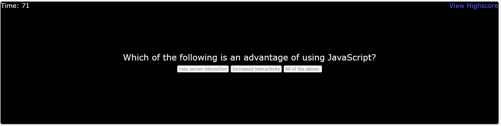

# code-quiz

# Unit 4 Web APIs: Code Quiz Assignment

## Description
This project is a timed coding quiz with multiple-choice questions featuring dynamically updated HTML and CSS powered by JavaScript code.

When prompted the quiz should meet the following criteria:

1. On click of start button a timer of 75 seconds should start
2. By clicking answer choice, questions should loop to next prompt question
3. When a question is answered incorrectly time is subtracted from the timer, vice versa, if answered correctly points will be added to the highest score
4. When the game is over, user should be able to save intials and score 

## Screenshots

The following images shows the web application's appearance and functionality:

## Deployed Project Location: 
* Page published at: https://almurawski15.github.io/code-quiz/

## Creator Comments

This particular assignment was really difficult. I was able to get most of the code working, left a few glitches including the timer that doesn't stop. With more time and a recent understanding of bootstrap and jquery I would of liked to spend more time on the appearance and functionality of the Javascript! 